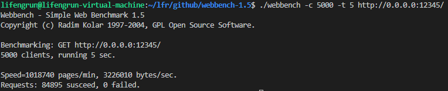
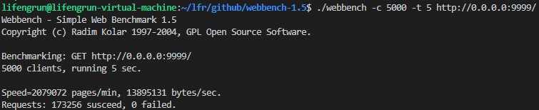

# HAHAWebServer

一个用c++20实现的高并发http服务器，支持servlet，目前还在更新中

## 技术特点：

* 支持两种模型：
    - 单reactor模型： epoll + 阻塞队列 + 线程池
    - one loop per thread模型，参考项目muduo

* 对锁、线程、线程池、文件操作等基本操作都进行了封装

* 使用自己实现的json解析库haha_json(对应目录中的haha_json)，支持读取ANSI和unicode格式的json数据

* 使用自己实现的日志库haha_log(对应目录中的log)，异步模式下单线程每秒能输出接近160万条日志

* 采用时间堆管理超时连接

* 利用智能指针进行内存的管理，最大限度避免内存泄漏

* 利用mmap或sendfile进行文件传输


## 目前支持如下功能：

* 支持http1.0、http1.1协议

* 支持解析普通文本、url编码、json格式等数据

* 支持cookie和session（目前存储在内存中）

* 支持文件的上传和下载

* 提供servlet编程接口（有待进一步完善）

## 未来的计划：

* 添加对https的支持

* 将数据存储进mysql，比如session，用户登录的账号和密码等

* 实现更完善的http协议（http2.0、websocket等）

* 实现RPC

* 实现负载均衡功能

* 基于该框架，实现诸如聊天室、email、游戏服务器等功能


## 快速使用：

编译
```shell
cd 当前目录
./build_release.sh
```
运行
```shell
cd 当前目录
./run_httpServer_release.sh
```

测试：

    运行后，打开浏览器，输入http://你的ip地址:9999/
    例如 http://0.0.0.0:9999/dog.html

## 运行配置

配置文件在bin目录下的configs文件夹中，默认为base_config.json

内容如下所示
```json
{
    "server": {
        "port": 9999,
        "timeout": 120,
        "timerInterval": 5
    },
    "EventLoopThreadPool":{
        "threadNum": 4
    },
    "log": {
        "open": true,
        "default_format": "%d{%Y-%m-%d %H:%M:%S}%T%t%T%N%T%T[%p]%T[%c]%T%f:%l%T%m%n"
    }
}
```

### 配置内容解释
    - port: 服务端口号
    - timeout：tcp连接超时时间，单位为秒
    - timerInterval: 定时器轮询间隔时间，单位为秒
    - threadNum：线程数，不设置的话就默认为cpu核数
    - open：true为打开日志，false为关闭，主要是为了做性能测试
    - default_format：默认的日志输出格式
        %m -- 消息体
        %p -- level
        %c -- 日志名称
        %t -- 线程id
        %n -- 回车换行
        %N -- 线程名称
        %d -- 时间
        %f -- 文件名
        %l -- 行号
        %T -- tab


## 压力测试

单reactor模型在分支single_reactor中

"one loop per thread"模型在分支"one_loop_per_thread"中

main分支采用"one loop per thread"模型，且是完全体版本

### 测试环境
- 测试环境是我电脑的虚拟机，webbench和服务器都同时运行在虚拟机上
- cpu为i5-10400F
- 内存4G
- 6线程


以下分别对nginx、TinyWebServer和HAHA-WebServer做压力测试
使用TinyWebServer中自带的Webbench进行测试
没有提到的地方都采用默认配置

HAHA和Tiny每次响应的页面数据量基本接近（TinyWebServer对默认的webbench请求返回的是404页面，跟HAHA的默认返回页面差不多大），因而可以排除页面大小干扰

### 测试结果

* 用webbench对nginx进行压力测试的结果


* 用webbench对muduo进行压力测试的结果，采用其自带的httpserver_test, release模式编译，同时我注释掉了日志输出的代码以防对性能造成干扰


* 用webbench对TinyWebServer进行压力测试的结果，关闭日志，LT+ET模式，不开启编译优化


* 用webbench对TinyWebServer进行压力测试的结果，关闭日志，LT+ET模式，开启O2级别编译优化


* 用webbench对HAHA-WebServer进行压力测试的结果，单reactor搭配阻塞队列模型，不开启编译优化


* 用webbench对HAHA-WebServer进行压力测试的结果，单reactor搭配阻塞队列模型，开启O2级别编译优化，关闭日志


* 用webbench对HAHA-WebServer进行压力测试的结果，"one loop per thread" 模型，不开启编译优化，关闭日志


* 用webbench对HAHA-WebServer进行压力测试的结果，"one loop per thread" 模型，开启O2级别编译优化，关闭日志


* 用webbench对HAHA-WebServer进行压力测试的结果，"one loop per thread" 模型，开启O2级别编译优化，开启异步日志



* 在上述配置和条件下，取最佳表现:

    | 框架         | qps  | bytes/s   |
    | -------------- | ---- | --------- |
    | nginx          | 5W多 | 5000W左右 |
    | muduo          | 1W多 | 300W左右  |
    | TinyWebServer  | 1W多 | 200W左右  |
    | HAHA_WEBSERVER | 4W多 | 1700W左右 |


### 结果分析

通过上述结果，可得到如下信息:

- nginx碾压后两者，无论是qps还是传输数据量

- muduo的结果让我比较奇怪，按理不该这么差，可能有我没考虑的因素？

- 开启编译优化后，HAHA性能提升了数倍，远远好于TinyWebServer
    
- TinyWebServer开启O2级别编译优化后，性能并没有什么提升，不知是为何

- 采用one loop per thread模型，性能得到了一点提升

- 开启异步日志会带来15%的性能损失，不算很好，但对性能的影响还算可以接收


## Servlet使用

以下是servlet使用的小例子，代码在tests文件夹下的test_servlet.cc
```c++
#include <string>
#include <unordered_set>
#include "http/Servlet.h"
#include "http/HttpServer.h"

// 工作目录为可执行文件所在目录，即bin目录
// bin目录下有个resource目录，建议把你要加的html、图片之类的放那里边
static const std::string BASE_ROOT = "./resource";

// 这里只是个示例，与默认处理近似，可自行修改
// 但大体流程不建议变动
void watch_dog(haha::HttpRequest::ptr req, haha::HttpResponse::ptr resp){
    // auto &reqBody = req->getBody();
    // // 如果请求中有session，就会返回一个已有的
    // // 如果没有或者是过期的，那就会创建一个新的session
    // haha::HttpSession::ptr session = req->getSession();
    // // 我还没怎么测过session，可能有bug

    auto code = resp->getStatusCode();
    // 出错，返回错误页面
    if(code >= 400){
        resp->setContentType(haha::HttpContentType::HTML);
        resp->appendBody(haha::Servlet::basePage(code));
        return;
    }

    std::string path = "/dog.html";

    std::filesystem::path p(BASE_ROOT + std::string(path));
    bool exists = std::filesystem::exists(p);
    
    if(exists){
        std::string ext;
        if(p.has_extension()){
            ext = std::string(p.extension().c_str());
        }
        std::unordered_set<std::string> accpetable_exts = {
            ".html", ".htm", ".txt", ".jpg", ".png"
        };
        if(accpetable_exts.find(ext) != accpetable_exts.end()){
            // auto fsz = std::filesystem::file_size(p);
            // // setFileBody是直接用read读取文件内容到缓冲区然后再write发出去
            // // 这个效率不高，但如果你想你可以用这个，虽然我不知道你为什么会想
            // // 最好使用setFileStream
            // // 二者不可以混用！！！
            // if(fsz <= small_file_limit){
            //     // 小文件
            //     resp->setContentType(Ext2HttpContentType.at(ext));
            //     resp->setFileBody(p.c_str());
            // }
            // else{
            //     // 大文件
            //     resp->setContentType(HttpContentType::HTML);
            //     resp->setFileStream(p.c_str());
            // }
            haha::HttpCookie cookie;
            cookie.add("liming", "hi");
            resp->setCookie(cookie);
            resp->setContentType(haha::Ext2HttpContentType.at(ext));
            resp->setFileStream(p.c_str());
        }
        else{
            resp->setContentType(haha::HttpContentType::HTML);
            resp->appendBody(haha::Servlet::basePage(code, "I don't know what do you really want"));
        }
    }
    else{
        resp->setStatusCode(haha::HttpStatus::NOT_FOUND);
        resp->setContentType(haha::HttpContentType::HTML);
        resp->appendBody(haha::Servlet::basePage(haha::HttpStatus::NOT_FOUND));
        return;
    }
}


int main(){
    // 这里的9999是端口号，可自行修改
    haha::InetAddress address(9999);
    haha::HttpServer server;
    // 添加servlet到服务器，这边我把两种请求都映射到了watch_dog上
    server.addServlet("/dog", [](haha::HttpRequest::ptr req, haha::HttpResponse::ptr resp){
        watch_dog(req, resp);
    });
    server.addServlet("/watch_dog", [](haha::HttpRequest::ptr req, haha::HttpResponse::ptr resp){
        watch_dog(req, resp);
    });

    server.start(address);
    return 0;
}
```
